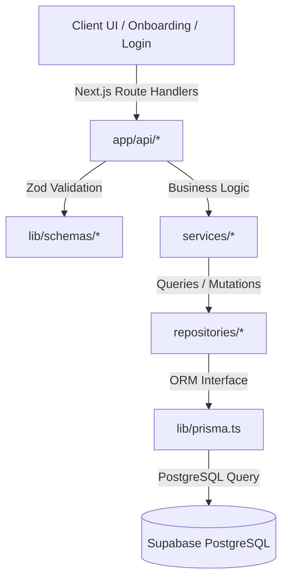

# 🏋️ FitBharat

An AI-powered, enterprise-grade fitness and wellness management platform combining workout tracking, nutrition planning, health analytics, medical profiling, and an interactive, gamified "Transformation Garden" centerpiece into one unified SaaS application.

[](https://nextjs.org/)
[](https://www.typescriptlang.org/)
[](https://www.postgresql.org/)
[](https://www.prisma.io/)
[](https://supabase.com/)
[](https://tailwindcss.com/)
[](#)
[](https://opensource.org/licenses/MIT)

---

<!-- Project Banner -->


---

## 📖 About

FitBharat exists to solve the fragmentation in the modern fitness SaaS landscape. Today, users must switch between multiple apps to count calories, log resistance training, analyze long-term health metrics, and maintain daily hydration habits. FitBharat unifies these tracking vectors into a single, high-performance web dashboard.

To combat user fatigue, the platform implements a gamified **Transformation Garden** canvas that maps user consistency, workout logs, and calorie counts directly into a beautiful SVG seedling that sprouts, grows, and blooms in real-time. 

### Major Project Goals:
- **Zero Friction Logging**: Minimal clicks required for entering water, steps, sleep, and workouts.
- **Deep Health Diagnostics**: Anti-aging diagnostics and biological markers computation.
- **Actionable AI Insights**: Dynamic meal description parsing using advanced natural language processing.
- **Highly Performant UI**: Implements Next.js server caching, responsive glassmorphism containers, and hardware-accelerated animations.

---

## 🚀 Key Features

### 🔐 Authentication & Session
* **Secure Signup / Login**: Robust credentials verification with bcrypt hashing, duplicate checks, and auto-initialized profiles.
* **Supabase & NextAuth Integration**: Secure HTTP-only cookies, JSON Web Token (JWT) session generation, and auto-refresh mechanisms.
* **Strict Route Guards**: Middleware-based page redirection protecting personal analytics, dashboards, and settings.

### 📊 Dashboard & Unified Metrics
* **Macro Trackers**: Interactive status progress rings showing target-vs-actual calories, protein, carbs, and fats.
* **Quick Logs Panel**: Immediate updates for water intake (Liters), steps count, and sleep hours.
* **Real-time Recalculations**: Automatic stats adjustment across widgets upon logging any workout or meal.

### 🏋️ Workouts & Exercise History
* **Routines Builder**: Multi-day splits catalogs with predefined instructions for Strength, Cardio, and HIIT routines.
* **Volume Logging**: Custom logger supporting duration tracking, sets, reps, weight logs, and calorie burn estimates.
* **Weight logs tracker**: Complete history logs mapping weight changes, body fat %, and muscle mass over 90 days.

### 🥗 Nutrition & AI Meal Parser
* **AI NLP Meal Parser**: Natural language input field translating descriptions (e.g., *"3 boiled eggs and oatmeal"*) into accurate macronutrient logs.
* **Meal Categorization**: Log meals grouped by Breakfast, Lunch, Dinner, or Snacks with historical search capabilities.

### 🌲 Gamified Garden
* **Live Growth Stage Canvas**: 5-stage SVG botanical tree growth responsive to user consistency parameters.
* **Active Spore Particles**: Framer motion floating spores and wind sway effects mapping consistency scores.

### 🏆 Challenges & Milestones
* **Reward Claims**: Daily and weekly challenges (e.g., Hydration, Consistency, Workouts) which unlock profile rewards and garden growth boosts.
* **Achievements Board**: Tracks milestones and awards trophies (e.g., *"Full Bloom"*) for healthy routines.

---

## 🛠️ Tech Stack

| Category | Technology | Description |
| :--- | :--- | :--- |
| **Framework** | Next.js 14.2.3 | React framework using App Router |
| **Language** | TypeScript 5.4 | Static typing for enterprise code quality |
| **Styling** | Tailwind CSS 3.4 | Utility-first CSS classes and layout utilities |
| **Database** | PostgreSQL | Enterprise relational database hosted on Supabase |
| **ORM** | Prisma 5.22 | Type-safe database queries and migrations engine |
| **Backend** | Route Handlers | Next.js server-side endpoint API layers |
| **Authentication** | Supabase Auth + NextAuth | JWT-based session storage and auth guards |
| **Validation** | Zod 3.23 | Schema validations for API payloads |
| **Charts** | Recharts 2.12 | Responsive SVG data visualization charts |
| **Icons** | Lucide React | High-quality SVGs for buttons and menus |
| **Animation** | Framer Motion 11.2 | Smooth transitions and state interactions |
| **Deployment** | Vercel | Production CDN edge hosting |

---

## 📂 Folder Structure

```
fitbharat-web/
├── app/                      # Next.js App Router root
│   ├── (auth)/               # Auth route groups (login, register, forgot-password)
│   ├── (dashboard)/          # Authenticated routes (dashboard, workout, nutrition, garden, settings)
│   ├── api/                  # Serverless Route Handlers (auth, dashboard, weight, garden, logs)
│   ├── globals.css           # Global Tailwind utilities and custom CSS variables
│   ├── layout.tsx            # Base layout wrapper
│   └── page.tsx              # Landing landing controller
├── components/               # Modular components architecture
│   ├── ui/                   # Reusable atomic UI (Button, Input, Badge, GlassCard)
│   ├── layout/               # Shell layout parts (Sidebar, Navbar)
│   └── garden/               # SVG Canvas graphics components for the gamified tree
├── docs/                     # Technical architecture documentation
├── lib/                      # Shared library singletons (prisma.ts, response.ts, password.ts)
│   └── schemas/              # Zod payload validation schemas
├── repositories/             # Database access repository wrappers (user, profile, workout, nutrition)
├── services/                 # Core business logic services (auth, garden, dashboard, nutrition)
├── store/                    # Zustand client-side state stores
└── public/                   # Static media files, assets, and Google Fonts
```

---

## 🖼️ Screenshots

### Dashboard
<!--  -->
*Placeholder for assets/screenshots/dashboard.png*

### Workout Split Planner
<!--  -->
*Placeholder for assets/screenshots/workout.png*

### Interactive Garden Canvas
<!--  -->
*Placeholder for assets/screenshots/garden.png*

### Progress Analytics & Trends
<!--  -->
*Placeholder for assets/screenshots/analytics.png*

### Profile & Settings Panels
<!--  -->
*Placeholder for assets/screenshots/settings.png*

### Authentication Interfaces
<!--  -->
*Placeholder for assets/screenshots/auth.png*

---

## ⚙️ Installation

Ensure you have [Node.js (v18+)](https://nodejs.org/) installed before proceeding.

### 1. Clone the Repository
```bash
git clone https://github.com/your-username/fitbharat.git
cd fitbharat
```

### 2. Install Dependencies
```bash
npm install
```

### 3. Setup Configuration
Copy the sample environment configuration file:
```bash
cp .env.example .env
```
Update the variables inside `.env` with your actual database and API credentials.

### 4. Build and Run Local Server
```bash
npm run dev
```
Open [http://localhost:3000](http://localhost:3000) in your web browser.

---

## 🔑 Environment Variables

| Variable | Required | Description | Example / Source |
| :--- | :--- | :--- | :--- |
| `DATABASE_URL` | Yes | Connection string for database pooled access | `postgresql://postgres.[ref]:[pass]@[host]:6543/postgres?pgbouncer=true` |
| `DIRECT_URL` | Yes | Direct connection string to database instance | `postgresql://postgres.[ref]:[pass]@[host]:5432/postgres` |
| `NEXTAUTH_URL` | Yes | Host URL for NextAuth logins and callbacks | `http://localhost:3000` |
| `NEXTAUTH_SECRET` | Yes | High-entropy string to sign JWT cookies | Run `openssl rand -base64 32` |
| `NEXT_PUBLIC_SUPABASE_URL` | Yes | Supabase project API link | `https://your-project.supabase.co` |
| `NEXT_PUBLIC_SUPABASE_ANON_KEY`| Yes | Supabase public API Key | From Supabase Project settings -> API |
| `SUPABASE_SERVICE_ROLE_KEY` | No | Supabase bypass security API Key | From Supabase Project settings -> API |
| `GOOGLE_AI_API_KEY` | No | Enables NLP Meal Parsing via Google Gemini | From Google AI Studio |
| `RESEND_API_KEY` | No | Enables password recovery emails | From Resend Dashboard |

---

## 🗄️ Database Setup

FitBharat uses Prisma ORM to interact with PostgreSQL.

### Initialize Schema
Sync the schema to your database instance:
```bash
npm run db:push
```

### Re-Generate Client
Generate the type-safe Prisma client:
```bash
npm run db:generate
```

### Run Prisma Studio
Open the local GUI database editor to view records:
```bash
npx prisma studio
```

---

## 🚢 Deployment

### Vercel Deployment
Next.js projects deploy natively to Vercel with automatic asset optimizations and edge routing:

1. Connect your repository on Vercel.
2. Configure **Environment Variables** in Vercel settings (match names in `.env.example`).
3. Set the **Build Command** override to:
   ```bash
   prisma generate && next build
   ```
4. Click **Deploy**.

### Supabase Setup
Ensure your PostgreSQL database instance has connection poolers enabled. Prisma must connect using transaction-mode poolers (`DATABASE_URL`) on Vercel edge functions.

---

## 🏗️ Architecture



### State Management & Lifecycle
- **Zustand stores** hold client states for fast interactivity (e.g. current routine splits, local hydration quick logs).
- API routes act as the single source of truth. When logging, a POST requests commits to Supabase and triggers a backend update to grow the **Transformation Garden** accordingly.

---

## 📡 API Structure

| Endpoint | Method | Auth | Description |
| :--- | :--- | :--- | :--- |
| `/api/auth/signup` | `POST` | Public | Registers a new user account |
| `/api/auth/login` | `POST` | Public | Validates credentials and logs in |
| `/api/auth/forgot-password` | `POST` | Public | Requests a password recovery link |
| `/api/auth/reset-password` | `POST` | Public | Updates user password with recovery token |
| `/api/profile` | `GET` | User | Fetches user settings, preferences, and profiles |
| `/api/profile` | `PATCH` | User | Updates height, weight targets, or medical history |
| `/api/workouts` | `GET` | User | Retrieves workout plans catalog |
| `/api/workout-logs` | `GET` | User | Retrieves paginated workout history |
| `/api/workout-logs` | `POST` | User | Logs a finished workout session |
| `/api/nutrition` | `GET` | User | Returns daily meal logs and macro metrics |
| `/api/nutrition` | `POST` | User | Logs a consumed food item |
| `/api/garden` | `GET` | User | Returns active garden consistency states |
| `/api/dashboard` | `GET` | User | Aggregates all daily stats in one call |
| `/api/weight` | `GET` | User | Fetches body weight logs history |

---

## 🔒 Security

- **Password Hashing**: Plaintext passwords are never stored. Passwords are securely hashed with `bcryptjs` using a salt factor of 12 before persistence.
- **JWT Protection**: Cookies containing sessions are signed and set as `HttpOnly`, `Secure`, and `SameSite=Lax` to prevent XSS-based session hijacking.
- **SQL Injection Prevention**: Prisma ORM executes parameterized queries under the hood, neutralizing SQL injection vectors.
- **Cross-Site Scripting (XSS) Prevention**: Middleware sets strict `Content-Security-Policy` (CSP) and sanitizes route query parameters.
- **Clickjacking Protection**: All responses are appended with `X-Frame-Options: DENY` headers to restrict iframe loading.

---

## ⚡ Performance

- **Lazy Loading**: Client widgets (like Recharts visualizations) are imported dynamically using Next.js `dynamic()` to reduce initial bundle loads.
- **Image Optimization**: WebP formats and native Next.js `<Image>` attributes serve responsive, compressed image sizes.
- **Optimized Database Queries**: Repositories select only needed fields rather than returning whole rows (`select` instead of `include` where appropriate).
- **Server Components**: The layout shell and non-interactive blocks utilize React Server Components (RSC) to minimize Client-Side Javascript footprint.

---

## 🗺️ Roadmap

- [ ] **AI Meal Planning**: Custom calorie/macro-compliant meal plan generation.
- [ ] **Wearable Integration**: Synchronize steps and sleep parameters via Apple Health and Google Fit.
- [ ] **Fitness Coach AI**: Interactive LLM chatbot offering routine suggestions based on injury histories.
- [ ] **Social Challenges**: Join public community leaderboard rooms and compete with peers.

---

## 🤝 Contributing

We welcome contributions! Please follow the contribution steps:

1. **Fork the Repository** on GitHub.
2. **Create a Feature Branch** from `main`:
   ```bash
   git checkout -b feature/amazing-feature
   ```
3. **Commit Your Changes** following Conventional Commits guidelines:
   ```bash
   git commit -m "feat: add user challenge points tracker"
   ```
4. **Push to Your Branch**:
   ```bash
   git push origin feature/amazing-feature
   ```
5. **Open a Pull Request** for peer review.

---

## 📄 License

Distributed under the MIT License. See [LICENSE](file:///LICENSE) for more details.

---

## 👨‍💻 Developer

- **Developer**: Krish Vasoya
- **GitHub**: [github.com/krish-vasoya](https://github.com/krish-vasoya) *(Placeholder)*
- **Portfolio**: [krishvasoya.dev](https://krishvasoya.dev) *(Placeholder)*
- **LinkedIn**: [linkedin.com/in/krish-vasoya](https://linkedin.com/in/krish-vasoya) *(Placeholder)*
- **Email**: [krish@fitbharat.com](mailto:krish@fitbharat.com) *(Placeholder)*

---

## 💖 Acknowledgements

- [Next.js](https://nextjs.org/) for routing and server structures.
- [Supabase](https://supabase.com/) for PostgreSQL hosting and serverless auth features.
- [Prisma](https://www.prisma.io/) for simplified type-safe database queries.
- [Tailwind CSS](https://tailwindcss.com/) for CSS framework utilities.
- [Lucide Icons](https://lucide.dev/) for dashboard icons.
- The open-source community for libraries and documentation.
