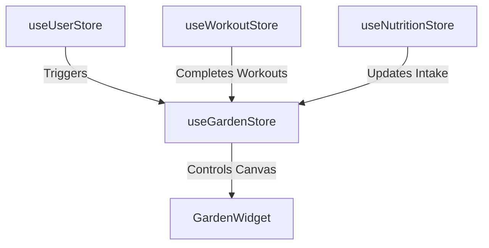

# Architecture Guide

This document describes the design architecture and client-server state data flow for **FitBharat**.

---

## 1. Store State Management (Zustand)

All client-side status parameters (workouts, nutrition intake, garden foliage details, and credentials profiles) are managed dynamically via decoupled **Zustand stores**:

* **`useUserStore`**: Holds active profile settings (height, target weight, activity levels) used for daily calorie target equations.
* **`useWorkoutStore`**: Tracks active workout logs timer, repetitions logs, sets tracking, and updates historical volumes.
* **`useNutritionStore`**: Manages logged food items, macro calculators (carbs, proteins, fats), and logs step count/sleep parameters.
* **`useGardenStore`**: Tracks overall hydration, sunlight index, and consistency calculations that trigger dynamic tree sprout evolutions.

---

## 2. Server Authentication Workflow (NextAuth)

NextAuth manages user login session tokens, caching access credentials via client cookie sessions and interfacing with Supabase databases:

* **OAuth Integration**: Configured with Google Authentication.
* **Fallback Credentials**: Uses mock database validations to allow immediate onboarding transitions for new guest profiles.
